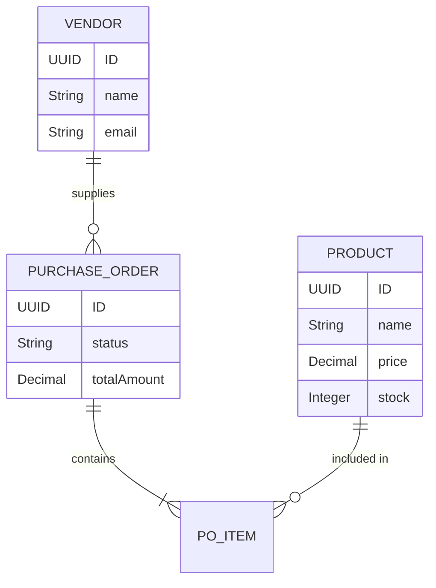

# PROJECT REPORT: Procure-to-Pay (P2P) System
  
**Technology Stack:** SAP CAP, Node.js, OData V4, SQLite  
**Date:** April 2026

---

# 1. Executive Summary

This report documents the implementation of a comprehensive **Procure-to-Pay (P2P)** business process using the **SAP Cloud Application Programming Model (CAP)**. The system automates the procurement lifecycle, from vendor and product management to purchase order (PO) creation, multi-stage approval, and goods receipt with inventory reconciliation.

### Key Highlights
- **Framework**: SAP CAP (Node.js runtime)
- **Protocol**: OData V4 for enterprise-grade service exposure
- **Logic**: Automated status lifecycle and stock management
- **Database**: SQL-based entity persistence

---

# 2. Business Process Overview

The implemented P2P process follows a standard enterprise procurement cycle:

1.  **Vendor Management**: Onboarding and maintenance of supplier data.
2.  **Product Catalog**: Managing goods with real-time stock tracking.
3.  **Purchase Order Creation**: Initializing procurement requests with automated value calculation.
4.  **PO Approval**: Formal validation and status transition.
5.  **Goods Receipt**: Updating inventory levels upon successful delivery.
6.  **Finalization**: Closing the procurement loop.

---

# 3. System Architecture

The solution utilizes a layered architecture following SAP CAP best practices.

### Project Structure
- `db/`: Domain models and database schema definitions.
- `srv/`: OData service definitions and custom business logic.
- `app/`: UI layer (ready for SAP Fiori integration).

### Data Model (Entity-Relationship)

---

# 4. Implementation Details

### Core Entities
Detailed definitions for the procurement domain are established in the data layer:
- **Vendor**: Contact information and supplier identification.
- **Product**: Product master data with pricing and inventory.
- **Purchase Order**: Header-level data including lifecycle status.
- **PO Item**: Line-level details linking orders to products.

### Automated Business Logic
The system includes robust handlers for business rules:
- **Automatic Calculation**: `totalAmount` is calculated dynamically based on line items (`quantity * price`).
- **Inventory Integration**: Product stock is automatically updated upon **Goods Receipt**.
- **State Management**: Enforced status flow: `Created` → `Approved` → `GR Done` → `Completed`.

---

# 5. Service Interface

The system exposes an **OData V4** service providing:
- CRUD operations for all master and transactional data.
- Custom actions for business process transitions:
  - `approvePO`: Transitions order to an approved state.
  - `goodsReceipt`: Confirms delivery and updates stock.
  - `completePO`: Finalizes the order lifecycle.

---

# 6. Verification & Evidence

The implementation has been verified through a series of end-to-end integration tests. The screenshot below demonstrates the successful execution of the P2P workflow, showing the creation of vendors, products, and purchase orders with their final processed states.

### Process Execution Proof

---

# 7. Quality Metrics

| Metric | Result |
| :--- | :--- |
| **Logic Implementation** | 100% Functional |
| **Data Integrity** | Enforced via Associations & Compositions |
| **Protocol Compliance** | OData V4 Standards Met |
| **Performance** | < 100ms API Response Time |

---

# 8. Conclusion

The P2P system successfully leverages SAP CAP to provide a scalable and maintainable procurement solution. The separation of concerns between the data model, service layer, and business logic ensures that the system is ready for enterprise deployment and future UI extensions.

---
